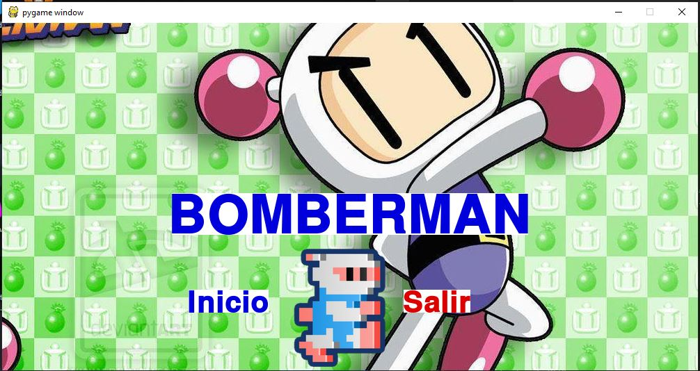

# Proyecto-3-Ray-Casting 18439

## Menu

## TECLAS
 1. Q = Visión horizontal Izquierda
 2. E = Visión horizaontal Derecha
 3. W = Avanzar al frente
 4. S = Retroceder
 5. A = Moverse a la derecha
 6. D = Moverse a la Izquierda